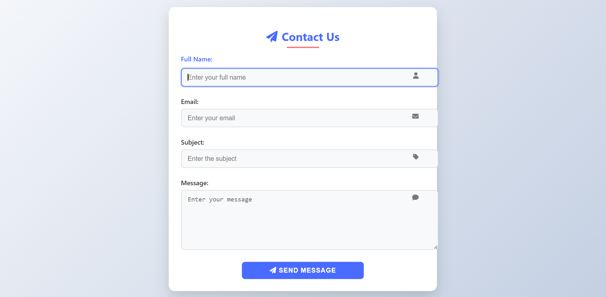

# 📩 Responsive Contact Form

A sleek and responsive contact form built with **HTML**, **CSS**, and **JavaScript**.  
The form adapts perfectly to all screen sizes — from mobile phones to large desktop monitors — ensuring a smooth user experience everywhere.

---

## ✨ Features

- **Fully Responsive**: Works seamlessly on mobile, tablet, and desktop.
- **Clean Layout**: Minimal and modern design with adequate spacing between elements.
- **User-Friendly**: Clear input fields and a prominent submit button.
- **Basic Form Validation**:
  - Required fields check.
  - Valid email format check.
- **Accessible Design**: Easy to navigate for all users.

---

## 🛠️ Built With

- **HTML5** – Semantic and accessible form structure.
- **CSS3** – Custom styling and responsive design.
- **JavaScript (Vanilla)** – Basic client-side form validation.

---

## 📸 Screenshot

  

---
