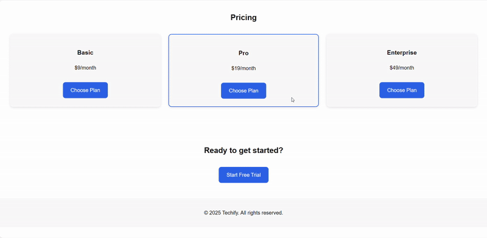

# 🚀 Tech Product Landing Page

This project is a **responsive and modern landing page** created for a fictional SaaS tech product.  
It is designed with a clean layout and smooth user experience in mind, adapting perfectly to **mobile, tablet, and desktop devices**.  
The page highlights key sections such as **Hero, Features, Testimonials, Pricing, and Call-to-Action**, making it suitable for marketing and product promotion.  

A special feature of this project is the **Light/Dark theme toggle**, implemented with JavaScript, allowing users to switch between two modes for better accessibility and personalization.

---

## 🎥 Demo Video
You can watch the demo here:  

