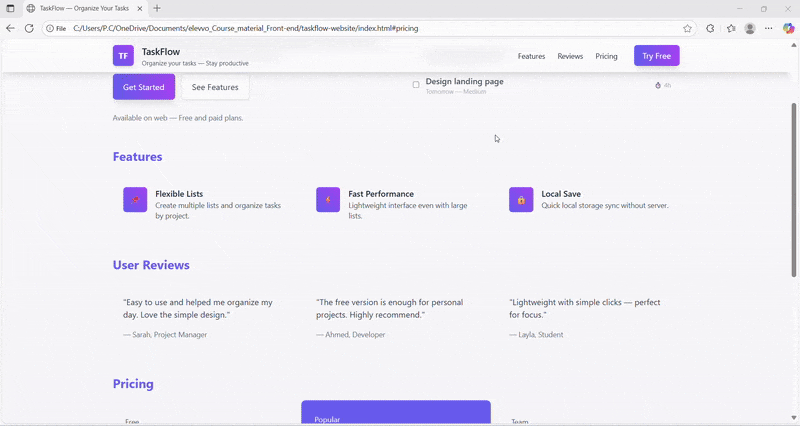

# TaskFlow — One Page Task Management Website

A modern, responsive, and visually appealing one-page website for task management, built using **HTML**, **CSS (Tailwind)**, and **JavaScript**.  
This project showcases a clean UI design with gradients, glassmorphism, and smooth animations.

---

## ✨ Features
- **Responsive Design** — Works seamlessly on desktop, tablet, and mobile devices.
- **Modern UI** — Gradient backgrounds, glassmorphism effects, and enhanced shadows.
- **Smooth Animations** — Scroll-triggered fade-up animations.
- **Pricing Section** — Includes a highlighted “Popular” plan.
- **Mobile Navigation** — Toggle menu for smaller screens.

---

## 🛠️ Technologies Used
- **HTML5** — Structure and content.
- **Tailwind CSS** — Utility-first CSS framework for styling.
- **JavaScript (ES6)** — For interactivity and animations.
- **IntersectionObserver API** — To trigger animations on scroll.

---

## 🎥 Project Demo
### GIF Preview

